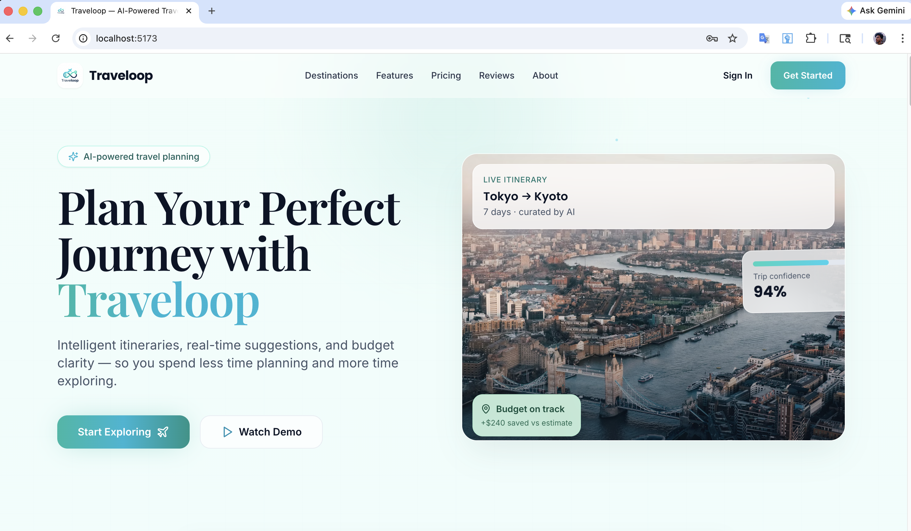
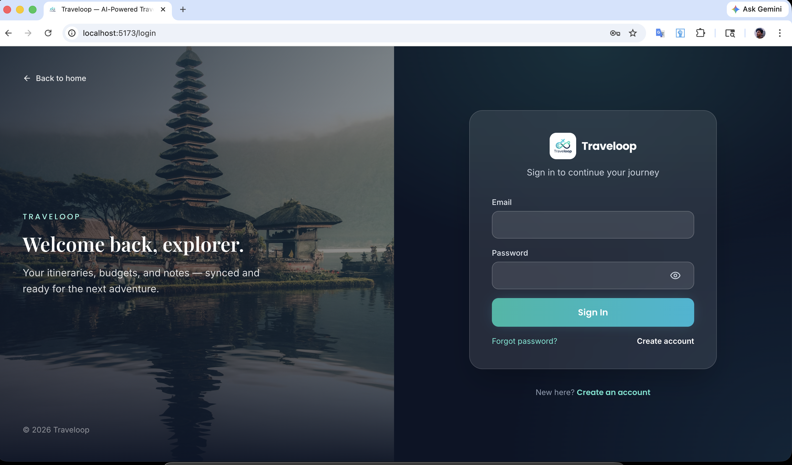
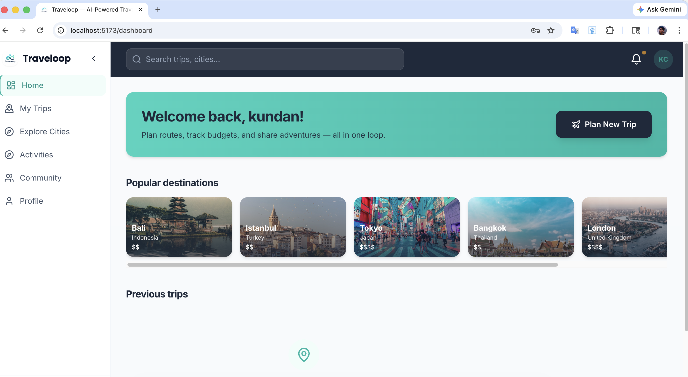
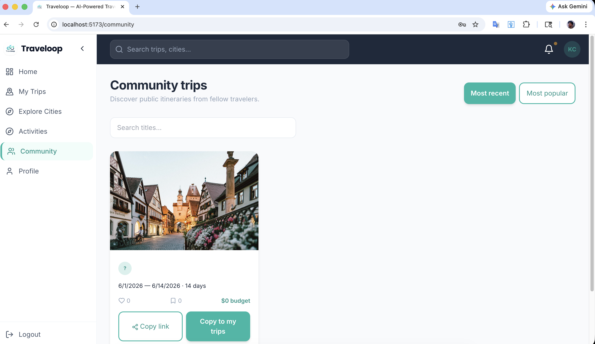
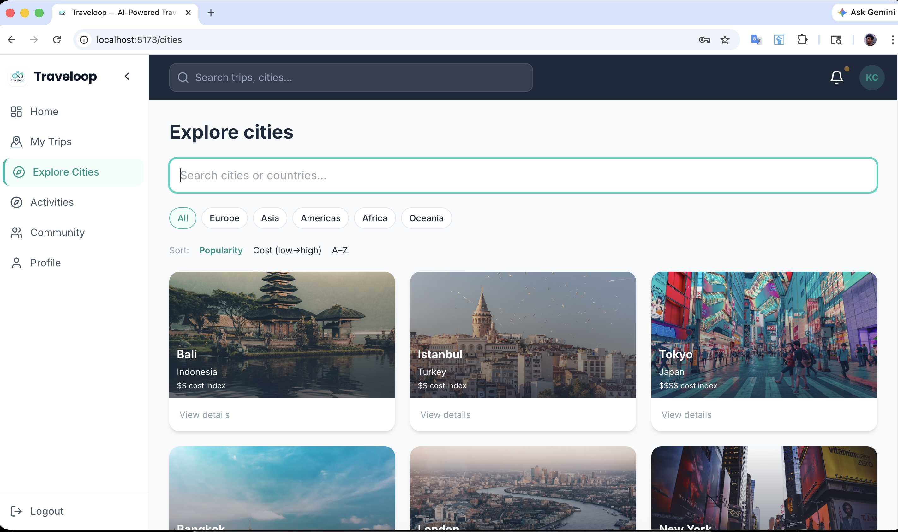

# ✈️ Travelloop — Travel Planning App

> **Plan routes, track budgets, and share adventures — all in one loop.**

Travelloop is a modern, AI-powered travel planning web application that helps users create intelligent itineraries, manage budgets, explore destinations, and collaborate with other travelers.

---

## 📸 Screenshots (Page-by-Page Walkthrough)

### 1. 🏠 Landing Page — Hero Section
**URL:** `localhost:5173`



The public-facing homepage introduces Travelloop with a bold headline and a live itinerary preview widget showing real-time budget tracking and AI confidence scores.

- "Plan Your Perfect Journey with Travelloop" headline
- Live itinerary demo card (e.g., Tokyo → Kyoto, 7 days, 94% confidence)
- **Start Exploring** and **Watch Demo** CTAs
- Top nav: Destinations, Features, Pricing, Reviews, About, Sign In, Get Started

---

### 2. 🔐 Login Page
**URL:** `localhost:5173/login`



Split-screen layout:
- **Left:** Full-bleed destination photo (Bali temple) with tagline: *"Welcome back, explorer."*
- **Right (dark card):** Email + Password fields, Show/Hide password toggle, Sign In button, Forgot Password, Create Account link

---

### 3. 📝 Signup Page
**URL:** `localhost:5173/signup`


Split-screen layout (Tokyo street scene backdrop):
- **Left:** Quote — *"The world is wide — your plan should be too."*
- **Right (dark card):** First Name, Last Name, Email, Phone Number, City, Country (dropdown), Password, Additional Information fields + Create Account button

---

### 4. 📊 Dashboard (Home — After Login)
**URL:** `localhost:5173/dashboard`



The main user dashboard after authentication:

- Personalized welcome banner: *"Welcome back, [username]!"* with **Plan New Trip** CTA
- **Popular Destinations** horizontal scrollable carousel (Bali, Istanbul, Tokyo, Bangkok, London) with cost index indicators ($$–$$$$)
- **Previous Trips** section (shows past trip history)
- Left sidebar navigation: Home, My Trips, Explore Cities, Activities, Community, Profile

---

### 5. 👥 Community Page
**URL:** `localhost:5173/community`



Discover and share public trip itineraries:

- Section title: *"Community trips — Discover public itineraries from fellow travelers."*
- Toggle: **Most Recent** | **Most Popular**
- Search bar: "Search titles..."
- Trip cards with destination photo, travel dates, duration, likes, comments, budget tag
- Action buttons: **Copy link** | **Copy to my trips**

---

### 6. 🌍 Explore Cities Page
**URL:** `localhost:5173/cities`



Browse and discover travel destinations:

- Search bar: "Search cities or countries..."
- **Filter tabs:** All | Europe | Asia | Americas | Africa | Oceania
- **Sort options:** Popularity | Cost (low→high) | A–Z
- City cards in a 3-column grid with photo, city name, country, and cost index
- "View details" link on each card
- Cities shown: Bali, Istanbul, Tokyo, Bangkok, London, New York, and more

---

## 🧭 Page Flow Summary

```
Landing Page (/)
    ├── Features Section (scroll)
    ├── Pricing Section (scroll)
    ├── Sign In → /login
    └── Get Started → /signup

After Login:
    /dashboard
        ├── /cities       → Explore Cities
        ├── /community    → Community Trips
        ├── /activities   → Activities
        ├── /trips        → My Trips
        └── /profile      → User Profile
```

---

## 🛠️ Tech Stack (Inferred from UI)

| Layer | Technology |
|---|---|
| Frontend Framework | React (Vite — port 5173) |
| Styling | Tailwind CSS |
| Routing | React Router |
| AI Features | GPT-based itinerary generation |
| Auth | JWT / Session-based login |

---

## 📄 License

© 2026 Traveloop. All rights reserved.
